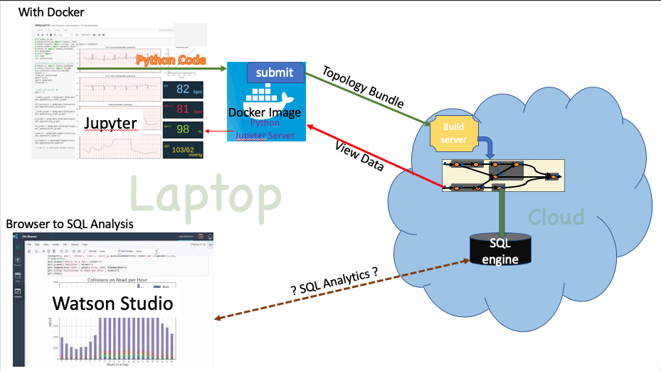
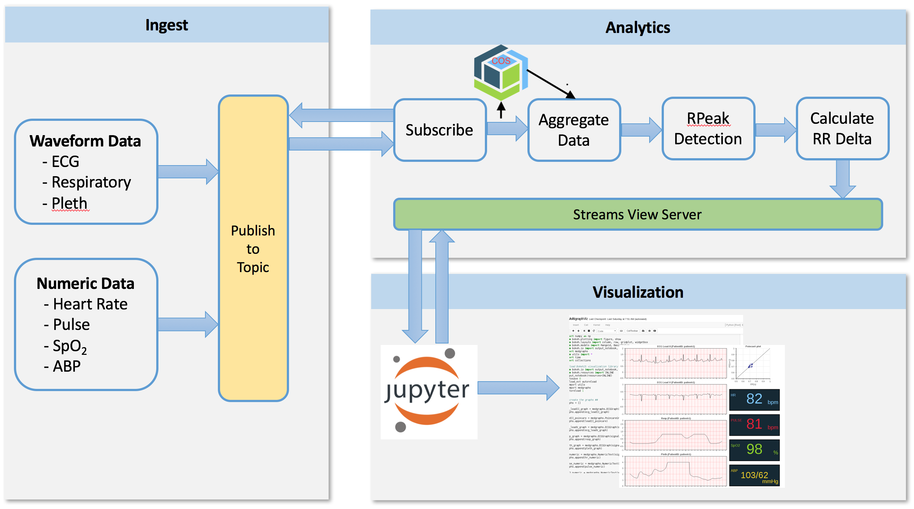
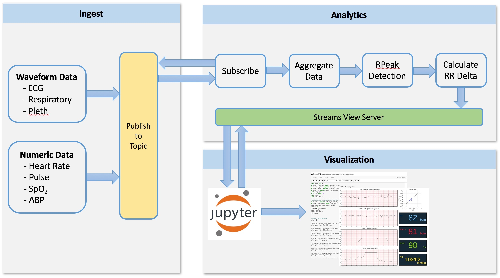

#ROADMAP
The notebooks described below compose applications in the Docker image. The 
image includes 
the Python3.5, Jupyter Server (rendering this notebook) and the 
requisite modules that : compose, build (@ build server) and submit to your instance

The distinguishing factor of the applications in this directory is that the code
is built and run on the Cloud. You do not need to install the Streams build
environment. 

## HeathcareDemo : base
Application subscribes to a data generator, processes the data and renders views of the data in a Jupter notebook. 

- In order run the application you need to create and configure the instance. 
[HealthcareSetup.ipynb](HealthcareSetup.ipynb) walks through configuration steps.
- The [HealthcareDemo.ipynb](HealthcareDemo.ipynb) notebook walks through the  
building, submitting and rendering process. 

## HealthCareCOS : 
Same application as above with the addition of writing the data received to 
Cloud Object Store (COS). Data that is written to COS can be retrieved using 
SQL Query Service.

- If you have not setup your Streams instance, go through the process described in 
[HealthcareSetup.ipynb](HealthcareSetup.ipynb)
- [HealthcareCOSSetup.ipynb](HealthcareCOSSetup.ipynb) walks through the allocation and
configuration of COS.
- The [HealthcareCOS.ipynb](HealthcareCOS.ipynb) notebook walks through the building 
submitting and rendering process.
- The [SQLCOS.ipynb] access the data stored by the previous notebook. 

 

