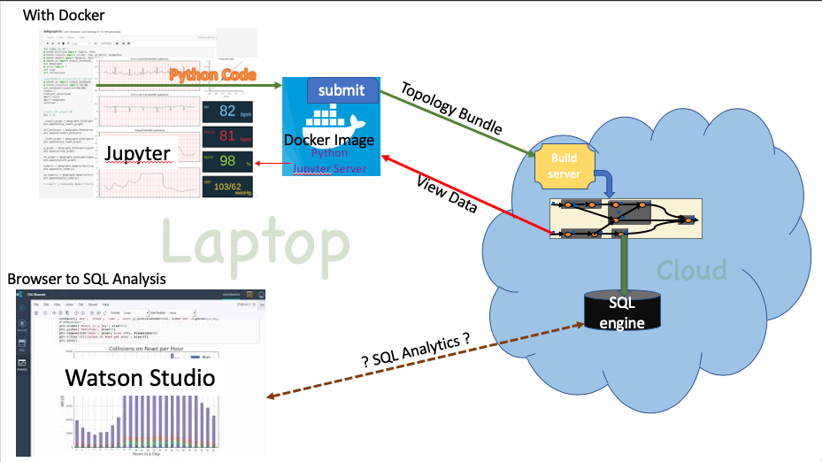
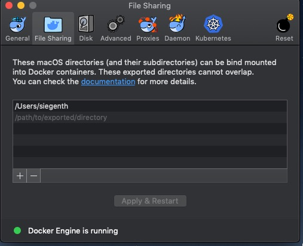

## Docker HealthacareDemo

This is a walkthrough of submiting an application to a Streams instance running on the Cloud. This is derived from 
the example in [samples/HealthcareJupterDemo]("../../samples/HealthcareJupyterDemo"). The 'samples' version
requires an instance of Streams on the local machine. This version does not, the Streams is composed within 
the Docker image then built and run on the Cloud.


The following diagram illustrates the running application. 


- A Docker image with Python with Jupyter, Java and Streams modules is built. 
- The container is run with the Jupyter server.
- The Jupyter server is accessed from your local computer (laptop).
- The 'HeathcarerSetup' notebook walks through the creation of the Streams instance in the Cloud.
- The 'HealthcareDemo' notebook builts ans submits a simulator and application from the Docker container to the Cloud
- The the data is rendered in the notebook. 

Currently store to COS, the EventStore is still in process. 
- The data processed in the Cloud on Streams is stored in a EventStore. 
- WatsonStudio can access the Stored data and do Analysis to generate insights on the realtime data.

## Prequisites 

* Git installed on your local system. 
* Docker installed on your local system.

## Configure Docker
In order not to lose the Jupyter notebook files when the container is
deleted, you bind mount ..docker/HealthcareJupyterDemo/notebook on the host
machine to the container. This is done through docker configutation tool. 

Assuming the project cloned into your home directory, set the Docker preferences | File Sharing 
to your home directory. In the case of my home  directory ('/Users/siegenth'), this is what my preferences looks like....



For this change to take place, Docker must be rebooted. 


## Build and Start

After downloading or cloning the image from github, enter the docker directory.

```bash
cd docker
```

Build the Docker image. 
```bash
./jupyterBuild.sh

```
Start Jupyter in the container using the built Docker image.
```bash
./jupyterStart.sh
```
Open the Jupyter notebook using: [http://localhost:8888](http://localhost:8888)


### Overview of next steps

* In order to run a Streams instance on the Cloud you must create a Streams resource and move it's credentials to your
Docker image, select [HealthcareSetup.ipynb](http://localhost:8888/HealthcareSetup.ipynb) to walk through this process. 
It is only necessary to run this notebook once, the configuration is written to a file for subsequent runs.
* [HealthcareDemo.ipynb](http://localhost:8888/HealthcareDemo.ipynb) walks through the demo application, it composes and 
submits the application to your Streams instance running in the Cloud.   

### Shutdown active applications

Run all the cells in  [HealthcareShutdown.ipynb](http://localhost:8888/HealthcareShutdown.ipynb)


## Stopping Jupyter container
control-c followed by contol-c in the Docker window.


