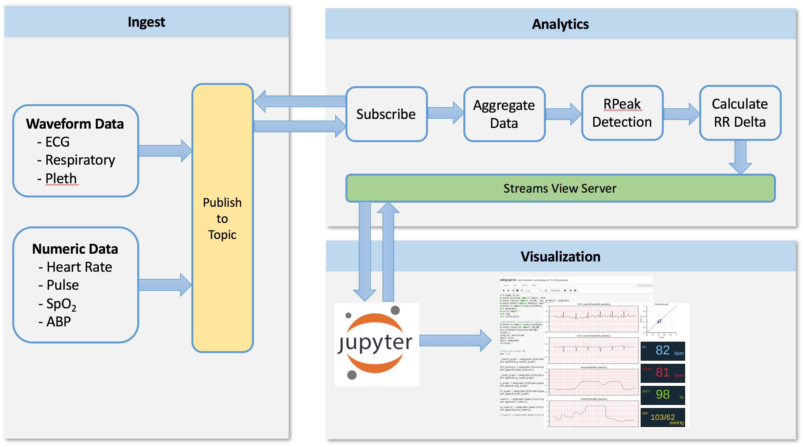
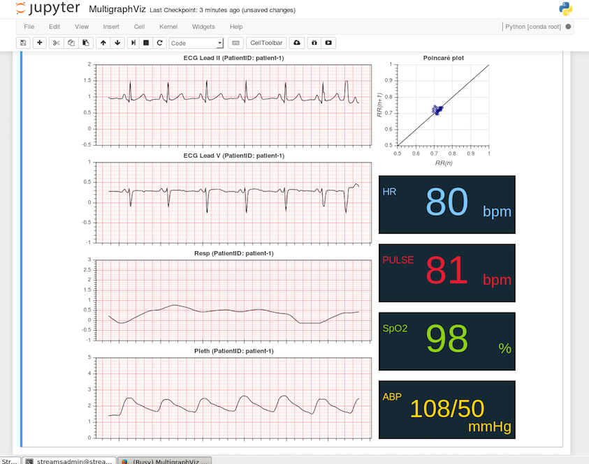

# Healthcare Python Streaming Application Demo
This application demonstrates how users can develop Python Streaming Applications from a Jupyter Notebook. The Jupyter Notebook ultimately submits two Streams applications to a local Streams cluster. The first application is a pre-compiled SPL application that simulates patient waveform and vital data, as well as publishes the data to a topic. The second application is a Python Topology application written using the Streams Python API. This application subscribes to the topic containing the patient data, performs analysis on the waveforms and sends all of the data, including the results of the analysis, to the Streams view server.

Submitting the Python application from the Notebook allows for connecting to the Streams view server in order to retrieve the data. Once the data has been retrieved, it can be analyzed, manipulated or visualized like any other data accessed from a notebook. In the case of this demo, waveform graphs and numerical widgets are being used to display the healthcare data of the patient, as show below.


This sample is built using the [BioSPPy](http://biosppy.readthedocs.io/en/stable/) Signal Processing Libraries.

The following diagram outlines the architecture of the demo.  



## Run the sample notebook 
The sample is [in the notebooks folder](notebooks/HealthcareDemo-Distributed.ipynb).


## Instructions to run from a Jupyter Notebook in the Streams Quick Start Edition

  1. Download [Anaconda 3.6 and install](https://docs.anaconda.com/anaconda/install/linux/). Allow Anaconda to update your `.bashrc` file. You will also need to update the version of the Bokeh library installed
      ```
      conda install bokeh
      ```

  2. Setup the .bashrc to set the PYTHONHOME to the root of anaconda install location.  This is necessary for the streaming analytics application to run.

      Set the following in .bashrc:
      ```
      export PYTHONHOME=/home/streamsadmin/anaconda3
      ```

  3. Restart the domain and instance to pickup the new environment variables
      ```
      source ~/.bashrc
      st stopinstance
      st stopdomain
      st startdomain
      st startinstance
      ```

  5. In the home directory, clone the git repository, navigate to *streamsx.health/samples/HealthcareJupyterDemo* and run `ant` to build the demo for your platform (< 5 minutes):
      ```
      git clone <repo>
      cd /home/streamsadmin/streamsx.health/samples/HealthcareJupyterDemo
      ant
      ```

  6. Start the Jupyter notebook from *streamsx.health/samples/HealthcareJupyterDemo*:
      ```
      ./start.sh
      ```

  7. In the web browser, open the *notebooks/HealthcareDemo-Distributed.pynb* notebook

## Running the notebook

  1. Run each cell individually. The following graphs should be displayed and updating in real-time. 



  2. If the graphs do not appear, verify that the Streams applications are running (and tuples are flowing) by opening the Streams Console.
